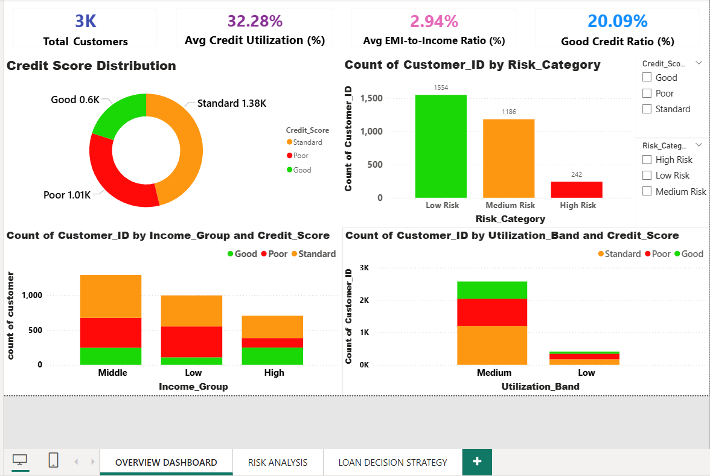
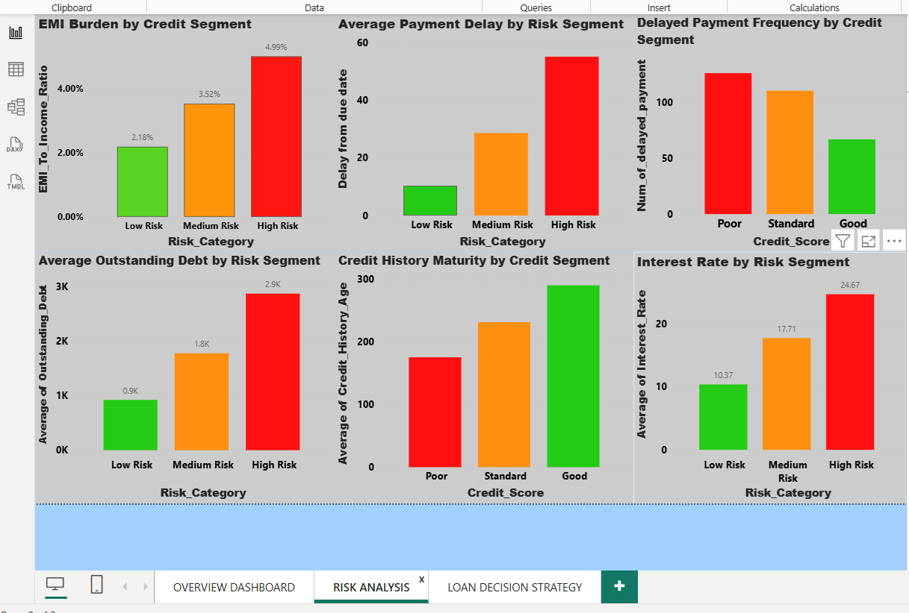
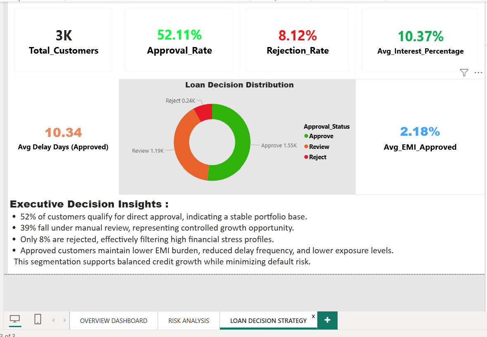

# Credit Risk Assessment Dashboard


## Live Project Files

Power BI Dashboard:  
credit_risk_assessment_project.pbix

Data Cleaning Notebook:  

Credit_risk_assessment_EDA.ipynb
# 📊 Credit Risk Assessment and Loan Decision Dashboard

## 📌 Project Overview

This project analyzes **customer financial behavior** to assess credit risk and support **data-driven loan approval decisions**.

Using **Python (Pandas)** for data preprocessing and **Power BI** for visualization, the dashboard provides insights into customer credit profiles, financial stress indicators, and loan approval strategies.

The objective of this project is to help financial institutions:

• Identify risky borrowers
• Understand customer financial behavior
• Apply risk-based pricing strategies
• Improve loan approval decision making

---

# 🛠 Tools and Technologies

| Tool            | Purpose                             |
| --------------- | ----------------------------------- |
| Python (Pandas) | Data Cleaning & Feature Engineering |
| Power BI        | Dashboard Development               |
| DAX             | KPI Calculations                    |
| Google Colab    | Notebook Execution                  |

---

# 📂 Dataset Description

The dataset contains financial information for approximately **3000 customers**.

Key variables include:

* Credit Score
* Annual Income
* Credit Utilization Ratio
* EMI to Income Ratio
* Outstanding Debt
* Payment Delay
* Credit History Age
* Interest Rate
* Loan Approval Status

These variables help evaluate **customer creditworthiness and repayment capacity**.

---

# 🧹 Data Preparation

Before building the dashboard, the dataset was cleaned and processed using **Python and Pandas**.

Steps performed:

• Handling missing values
• Removing duplicate records
• Correcting data types
• Standardizing categorical variables
• Creating new analytical features

---

# ⚙️ Feature Engineering

Several new features were created to improve analysis.

**EMI to Income Ratio**
Measures repayment burden relative to income.

**Credit Utilization Ratio**
Indicates how much credit a customer is using.

**Risk Category**
Customers were classified into:

* Low Risk
* Medium Risk
* High Risk

**Loan Approval Status**

Customers were categorized into:

* Approve
* Review
* Reject

This simulates a **real-world credit approval workflow**.

---

# 📊 Dashboard Structure

## Page 1 – Customer Portfolio Overview

Provides a high-level summary of the credit portfolio.

Key KPIs:

• Total Customers
• Average Credit Utilization
• EMI to Income Ratio
• Good Credit Ratio

This page helps understand the **overall financial health of customers**.

---

## Page 2 – Risk Segment Analysis

Analyzes financial behavior across risk segments.

Insights include:

• EMI burden across risk categories
• Payment delay trends
• Outstanding debt exposure
• Interest rate variation by risk level
• Credit history maturity

This page validates the **accuracy of risk segmentation**.

---

## Page 3 – Loan Approval Insights

Shows how customer risk translates into loan decisions.

Key metrics include:

• Approval Rate
• Rejection Rate
• Average Interest Rate (Approved Customers)
• Average Delay Days (Approved Customers)
• Average EMI Burden (Approved Customers)

This helps simulate **real-world loan approval strategies**.

---

## Dashboard Preview

### Portfolio Overview


### Risk Segment Analysis


### Loan Decision Insights


---

# 📓 Notebook (Data Cleaning & Feature Engineering)

Open the notebook in Google Colab:

👉 https://colab.research.google.com/drive/1460GPqlqNOfk3HB2nufzRGIhK0PWvuJK?usp=sharing

---

# 📁 Project Structure

```
Credit-Risk-Assessment-Dashboard
│
├── data
│   └── credit_risk_dataset.csv
│
├── notebooks
│   └── credit_risk_eda.ipynb
│
├── dashboard
│   └── credit_risk_dashboard.pbix
│
├── images
│   ├── page1_dashboard.png
│   ├── page2_dashboard.png
│   └── page3_dashboard.png
│
└── README.md
```

---

# 📈 Key Insights

• Majority of customers fall under the Low Risk segment.

• High Risk customers show higher payment delays and outstanding debt exposure.

• Approved customers demonstrate lower EMI burden and lower delay frequency, indicating financial stability.

• Risk-based pricing is observed where high-risk customers receive higher interest rates.

• The loan approval strategy balances credit growth and risk control by approving financially stable customers while placing medium-risk customers under review.

---
# Conclusion

This project demonstrates how customer financial behavior can be analyzed to identify credit risk and support better loan approval decisions using data analytics.

---
# 👨‍💻 Author

**N M Guru Prasaath**
Aspiring Data Analyst

GitHub: https://github.com/prasaath1605
